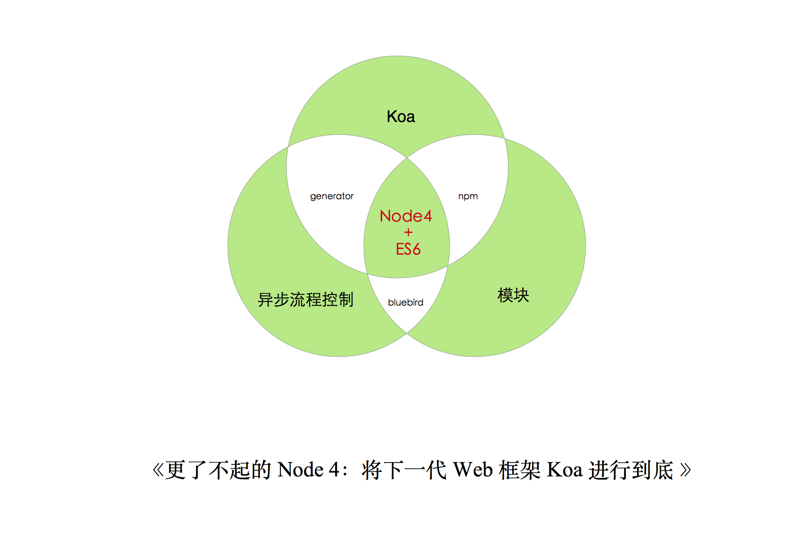
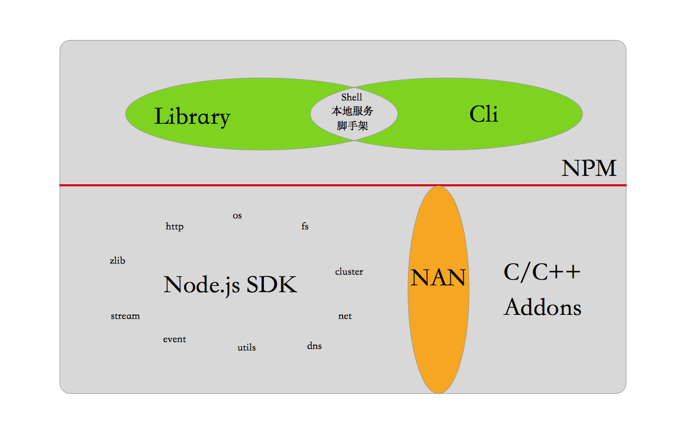
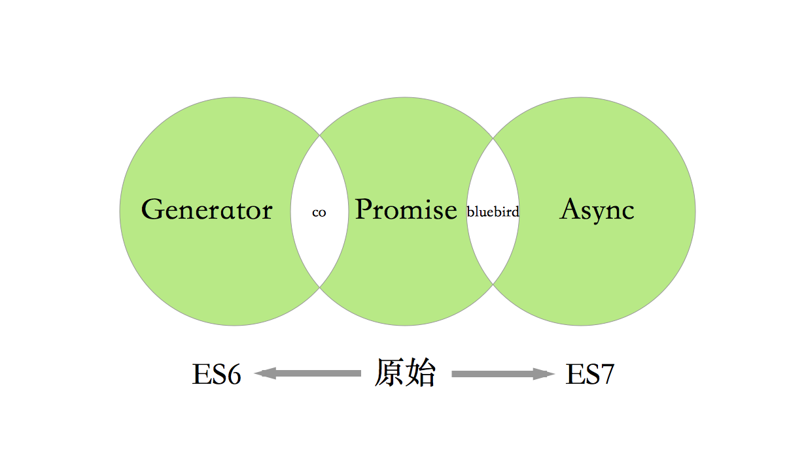

#《更了不起的 Node 4:将下一代 Web 框架 Koa 进行到底》

## 目录

- 一张图看懂Node.js核心
- 为什么要选Koa？Koa特性、性能、生态
- 异步流程控制改进
- Koa vs Express大比拼
- Koa实践
- 总结

## 一张图看懂Node.js核心

- node4 + es6
- koa
- 异步流程控制
- 模块

## 为什么要选Koa

- Koa核心
  - Context
  - Middleware
  - Generator
  - Router
  - Views
  - Lifecycle
- 性能
- 生态

## 异步流程控制改进（generator && co && async）

### generator

### co

### async

### promise

## Koa vs Express大比拼

## Koa实践

## 总结
