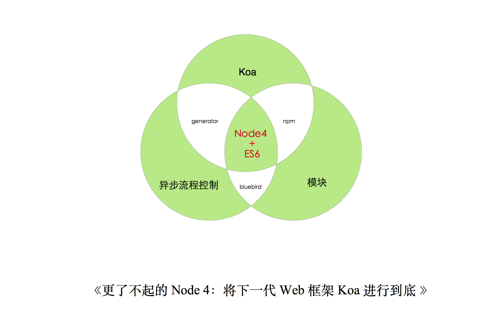
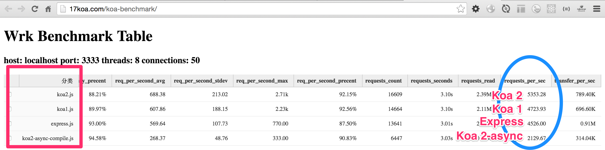
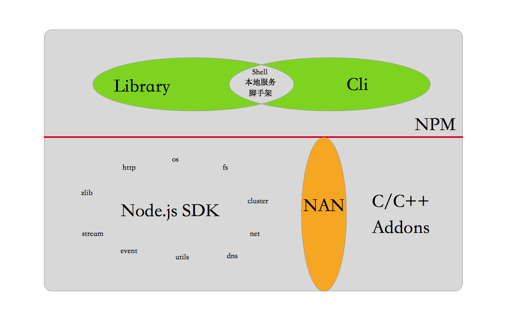
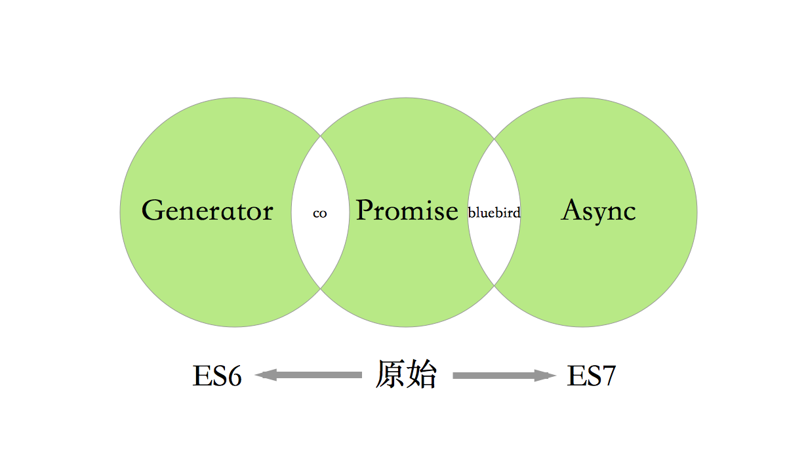

#《更了不起的 Node 4:将下一代 Web 框架 Koa 进行到底》

## 目录

- 一张图看懂Node.js核心
- 核心变更
- 推荐技术栈
- 为什么要选Koa？
- 异步流程控制改进
- Koa实践

## 一张图看懂Node.js核心



- node4 + es6
- koa
- 异步流程控制
- 生态与模块

## 核心变更

**es语法支持**

- 使用Node.js 4.x或5.x里的es6特性，如果想玩更高级的，可以使用[babel](babeljs.com)编译支持es7特性
- 合理使用[standard](https://github.com/feross/standard) 代码风格约定
- es6语法，写的一般，比较啰嗦，凑合看吧 http://es6.ruanyifeng.com/ 
- 需要大家重视OO（面向对象）写法的学习和使用，这是es的另一个好处,推荐蔡伟小兄弟的[《JavaScript Patterns》 examples in ECMAScript6](https://github.com/DavidCai1993/JsPatterns-ES6)


相比es语法，其实我本人更喜欢typescript的，不过写Node.js还是推荐跟Node SDK玩才是。

## 推荐技术栈

http://nodeonly.com/stack/

- koa 1.0 && 2.0 （koa2.0刚发布不久，喜欢折腾的可以考虑）
- mongoose（mongodb）
- bluebird（Promise/A+实现）
- jade（视图层模板）
- ava（测试）
- vscode(调试)

推荐生成器（稍后会把ava和bluebird加上）

https://github.com/17koa/koa-generator

## 为什么要选Koa

- 性能优势
- 异步流程优化
- 更多语法糖

###  性能



```
➜  koa-benchmark git:(gh-pages) make test -f Makefile2
npm WARN package.json koa2-benchmark@1.0.0 No README data

> koa2-benchmark@1.0.0 postinstall /Users/sang/workspace/17koa/koa-benchmark/koa2
> babel koa2-async.js  --out-file koa2-async-compile.js

npm WARN package.json koa-benchmark@1.0.0 No README data
prepare complete
benchmark koa-1

  1 middleware
  5893.92

  5 middleware
  5902.22

  10 middleware
  1935.14

  15 middleware
  5300.84

  20 middleware
  5137.80

  30 middleware
  5339.12

  50 middleware
  5049.62

  100 middleware
  4578.32

benchmark koa-2

  1 middleware
  5872.58

  5 middleware
  5729.20

  10 middleware
  4860.80

  15 middleware
  5767.69

  20 middleware
  5766.93

  30 middleware
  5446.56

  50 middleware
  5022.90

  100 middleware
  5250.70

benchmark koa-2-async

  1 async middleware
  5815.71

  5 async middleware
  4639.42

  10 async middleware
  4423.81

  15 async middleware
  4261.05

  20 async middleware
  4217.97

  30 async middleware
  3620.62

  50 async middleware
  2478.95

  100 async middleware
  1745.38

benchmark express

  1 middleware
  6374.90

  5 middleware
  6098.11

  10 middleware
  4436.94

  15 middleware
  4344.61

  20 middleware
  5904.50

  30 middleware
  5945.77

  50 middleware
  5171.96

  100 middleware
  4317.21
```

###  生态与模块




## Koa核心

  - Context
  - Middleware
  - Generator
  - Router
  - Views
  - Lifecycle

## 异步流程控制改进（generator && co && async）


